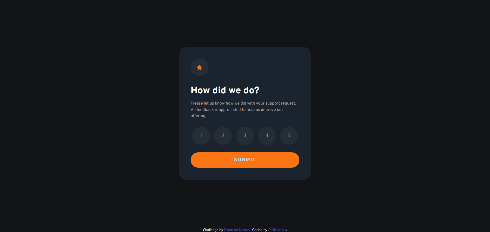
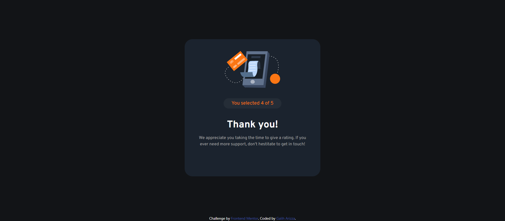
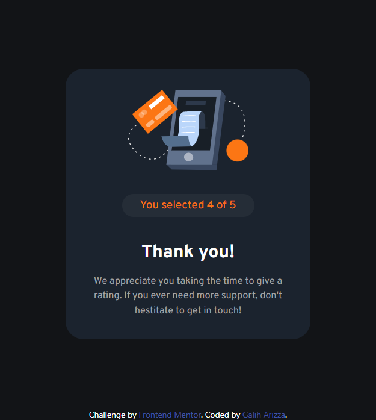

# Frontend Mentor - Interactive rating component solution

This is a solution to the [Interactive rating component challenge on Frontend Mentor](https://www.frontendmentor.io/challenges/interactive-rating-component-koxpeBUmI). Frontend Mentor challenges help you improve your coding skills by building realistic projects.

## Table of contents

- [Overview](#overview)
  - [The challenge](#the-challenge)
  - [Screenshot](#screenshot)
  - [Links](#links)
- [My process](#my-process)
  - [Built with](#built-with)
  - [What I learned](#what-i-learned)
- [Author](#author)

## Overview

### The challenge

Users should be able to:

- View the optimal layout for the app depending on their device's screen size
- See hover states for all interactive elements on the page
- Select and submit a number rating
- See the "Thank you" card state after submitting a rating

### Screenshot

<p align="center">
  
</p>
<p align="center">
  
</p>
<p align="center">
  
</p>
<p align="center">
  
</p>

### Links

- Solution URL: [https://github.com/chadittya/interactive-rating-component-react](https://github.com/chadittya/interactive-rating-component-react/)
- Live Site URL: [https://chadittya.github.io/interactive-rating-component-react](https://chadittya.github.io/interactive-rating-component-react/)

## My process

### Built with

- Flexbox
- Desktop-first workflow
- [React](https://reactjs.org/) - JS library
- [Vitejs](https://vitejs.dev/) - React framework
- [Tailwindcss](https://tailwindcss.com/) - For styles

### What I learned

This project i learn how to loop in react. So in this project there are 5 inputs (rating input) that have same style. So that when editing it doesn't take time to edit one by one effectively you have to use a loop for that components.

So i create function getRateButton like this that return whatever number we will input later:

```jsx
const getRateButton = (num) => {
  const array = [];

  for (let i = 1; i <= num; i++) {
    array.push(
      <input
        type="button"
        key={i}
        className="md:w-14 md:h-14 bg-bgNeutralDarkBlue rounded-full focus:bg-bgNeutralMediumGrey hover:bg-bgPrimaryOrange mobile:w-10 mobile:h-10 text-neutral-400"
        value={i}
        onClick={(e) => setRate(e.target.value)}
      />
    );
  }
  return array;
};
```

And you can call that function with input of 5 that will return 5 rating's buttons

```jsx
{
  getRateButton(5);
}
```

On that code above, i also get the value of the each rate inputs. So we can just call the value on event on submit and using react `useState` to change from index layout to thank-you layout.

```jsx
const handleSubmit = (e) => {
  e.preventDefault();
  setLoading(true);
  setRate(rate);
};
```

```jsx
{!loading &&(
  //index layout
)}
```

```jsx
{loading &&(
  //index thankyou
)}
```

## Author

- Github - [chadittya](https://github.com/chadittya/)
- Frontend Mentor - [@chadittya](https://www.frontendmentor.io/profile/chadittya)
- Twitter - [@galiharizza](https://www.twitter.com/galiharizza)
